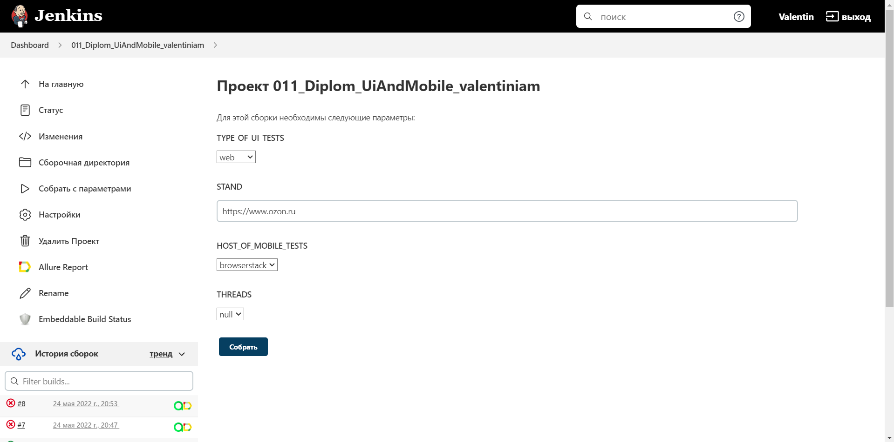
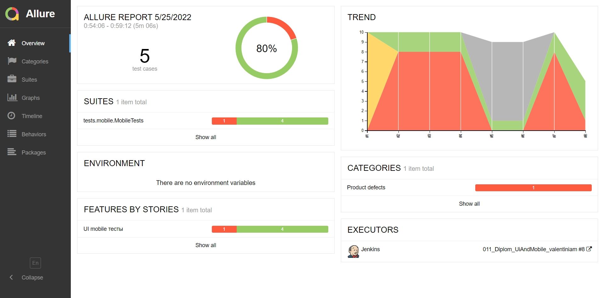
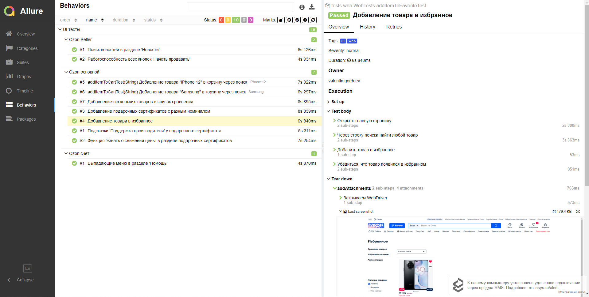
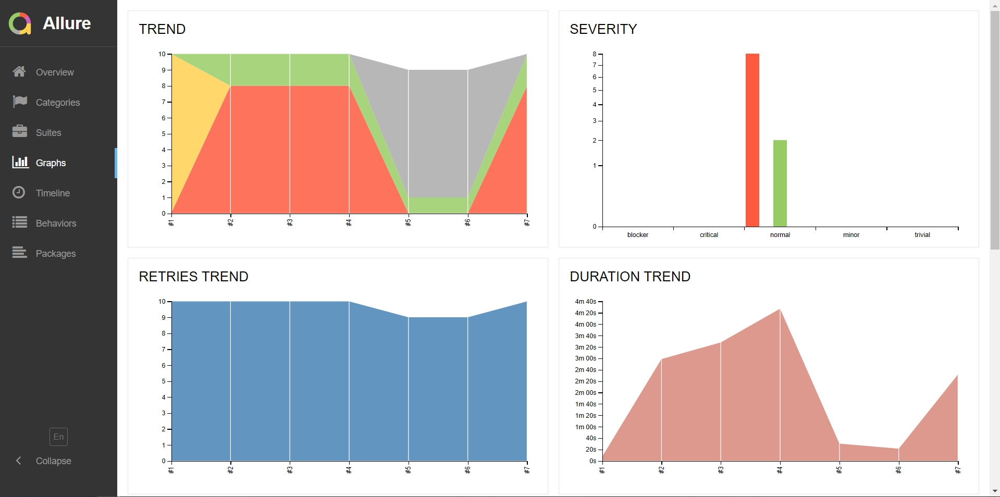
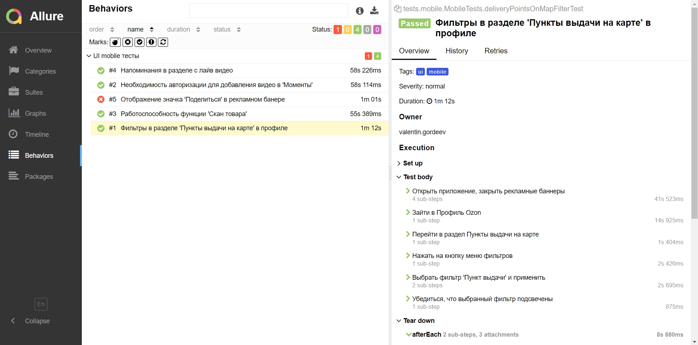
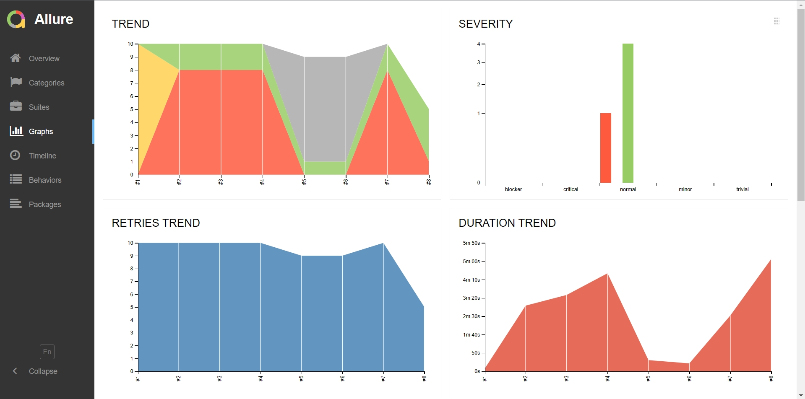
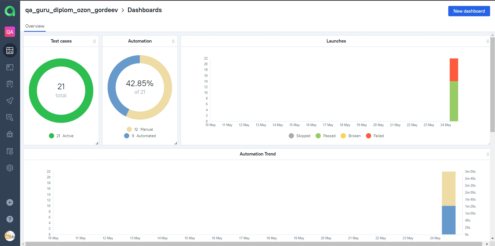
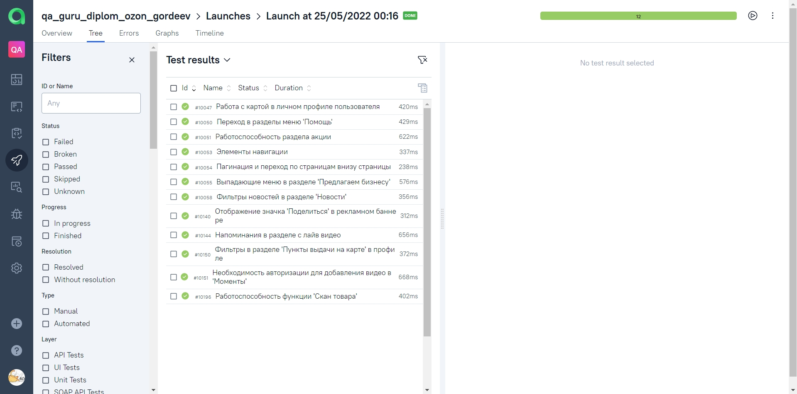

# Проект по автотестированию интернет-магазина [Ozon](https://www.ozon.ru/)

## Содержание:

* [Технологии, используемые в данном проекте](https://github.com/Valentine1337/Ozon_Web-Mobile_autotests/blob/master/Readme.md#%D1%82%D0%B5%D1%85%D0%BD%D0%BE%D0%BB%D0%BE%D0%B3%D0%B8%D0%B8-%D0%B8%D1%81%D0%BF%D0%BE%D0%BB%D1%8C%D0%B7%D1%83%D0%B5%D0%BC%D1%8B%D0%B5-%D0%B2-%D0%B4%D0%B0%D0%BD%D0%BD%D0%BE%D0%BC-%D0%BF%D1%80%D0%BE%D0%B5%D0%BA%D1%82%D0%B5)
* [Тест кейсы](https://github.com/Valentine1337/Ozon_Web-Mobile_autotests/blob/master/Readme.md#%D1%82%D0%B5%D1%81%D1%82-%D0%BA%D0%B5%D0%B9%D1%81%D1%8B)
* [Сборка в Jenkins](https://github.com/Valentine1337/Ozon_Web-Mobile_autotests/blob/master/Readme.md#%D1%81%D0%B1%D0%BE%D1%80%D0%BA%D0%B0-%D0%B2-jenkins)
* [Отчеты и информация о тестах в Allure report](https://github.com/Valentine1337/Ozon_Web-Mobile_autotests/blob/master/Readme.md#%D0%BE%D1%82%D1%87%D0%B5%D1%82%D1%8B-%D0%B8-%D0%B8%D0%BD%D1%84%D0%BE%D1%80%D0%BC%D0%B0%D1%86%D0%B8%D1%8F-%D0%BE-%D1%82%D0%B5%D1%81%D1%82%D0%B0%D1%85-%D0%B2-allure-report)
* [Интеграция с AllureTestOps](https://github.com/Valentine1337/Ozon_Web-Mobile_autotests/blob/master/Readme.md#%D0%B8%D0%BD%D1%82%D0%B5%D0%B3%D1%80%D0%B0%D1%86%D0%B8%D1%8F-%D1%81-alluretestops)
* [Уведомления в Telegram](https://github.com/Valentine1337/Ozon_Web-Mobile_autotests/blob/master/Readme.md#%D1%83%D0%B2%D0%B5%D0%B4%D0%BE%D0%BC%D0%BB%D0%B5%D0%BD%D0%B8%D1%8F-%D0%B2-telegram)
* [Пример аттачей](https://github.com/Valentine1337/Ozon_Web-Mobile_autotests/blob/master/Readme.md#%D0%BF%D1%80%D0%B8%D0%BC%D0%B5%D1%80-%D0%B0%D1%82%D1%82%D0%B0%D1%87%D0%B5%D0%B9)

## :computer: Технологии, используемые в данном проекте

В данном проекте автотесты написаны на **Java** с использованием фреймворков для тестирования **Selenide**. Для сборки проекта в среде **IntelliJ IDEA** используется **Gradle**.
**JUnit5** задействован в качестве фреймворка модульного тестирования. Запуск тестов выполняется из **Jenkins**. **Selenoid** используется для запуска браузеров в контейнерах **Docker**.

**Browserstack** используется для запуска мобильных тестов, для запуска на эмуляторе используются **Android Studio** и **Appium**. **Allure Report**, **AllureTestOps** и **Telegram Bot** используются для визуализации результатов тестирования.

## :clipboard: Тест кейсы

### Тест кейсы для UI web тестирования

✓ Добавление товара в избранное

✓ Добавление товара в корзину через поиск

✓ Добавление нескольких товаров в список сравнения

✓ Добавление подарочных сертификатов с разным номиналом

✓ Функция 'Узнать о снижении цены' в разделе подарочных сертификатов

✓ Подсказки 'Поддержка производителя' у подарочного сертификата

✓ Выпадающие меню в разделе 'Помощь'

✓ Поиск новостей в разделе 'Новости'

✓ Работоспособность всех кнопок 'Начать продавать'

### Тест кейсы для UI mobile тестирования

✓ Отображение значка 'Поделиться' в рекламном банере

✓ Напоминания в разделе с лайв видео

✓ Фильтры в разделе 'Пункты выдачи на карте' в профиле

✓ Необходимость авторизации для добавления видео в 'Моменты'

✓ Работоспособность функции 'Скан товара'

##  [Сборка в Jenkins](https://jenkins.autotests.cloud/job/011_Diplom_UiAndMobile_valentiniam/)
    gradle clean ${TYPE_OF_UI_TESTS}
    -DstandHost=${STAND}
    -DdeviceHost=${HOST_OF_MOBILE_TESTS}
    -Dthreads=${THREADS}

В данной сборке указаны следующие параметры:

`${TYPE_OF_UI_TESTS}` - тип тестов web или mobile (возможен запуск **web тестов** - в **selenoid**,
**mobile тестов** - в **Browserstack**, на эмуляторе в **Android Studio** c
помощью сервера **Appium**)

`standHost` - стенд (опция пустая, добавлена ради эмуляции боевого проекта). Указывается в виде URL **https://www.ozon.ru**, **https://www.test-ozon.ru** как пример.

`deviceHost` - хост для мобильных тестов (**Browserstack**, **emulator**)

`threads` - количество потоков для запуска теста (от null до 4)

Остальные опции настраиваются с помощью файла .properties, пример лежит в папке **resources**.

##  Отчеты и информация о тестах в [Allure report](https://jenkins.autotests.cloud/job/011_Diplom_UiAndMobile_valentiniam/)

### Дашбоард

_Мобильные тесты_

### Окно с тест-кейсами 

_Веб тесты_

### Окно с графиками

_Графики веб тестов_

_Мобильные тесты_

_Графики мобильных тестов_

##  Интеграция с [AllureTestOps](https://allure.autotests.cloud/project/1329/dashboards)

### Дашборд проекта

### Список ручных и автотестов

##  Уведомления в Telegram

После завершения тестов отчет о прохождении приходит в Telegram с помощью заранее созданного бота

### Для web тестов

## :movie_camera: Пример аттачей
К каждому тесту в Allure прикрепляется видеопрохождение, скриншот последнего экрана и код страницы

### Видео прохождения web тестов (пример)

### Видео прохождения mobile тестов (пример)

